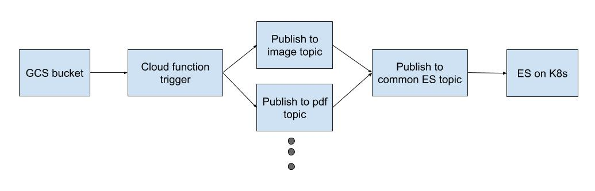

# OCR using GCS and Cloud Functions

Sample code to use google functions with vision API and google cloud storage. The result is dumped into elasticsearch which is running on K8s cluster exposed via IAP.

## Pipeline



## Pre setup

- Create pub/sub topic with name `image-file-type`
- Create pub/sub topic with name `pdf-file-type`
- Create pub/sub topic with name `es-upload`
- Copy env.yaml.sample to env.yaml and update required values

```
WARNING: The env.yaml file has service account credentials which should be stored as a secret but it is out of scope for this PoC to do so. To learn more about it see [this](https://cloud.google.com/solutions/secrets-management/).
```

## Deployment
```
gcloud functions deploy DispatchWithFileType \
  --runtime go111 \
  --trigger-resource <target_bucket_name> \
  --trigger-event google.storage.object.finalize
```

```
gcloud functions deploy DetectTextsFromImage \
  --runtime go111 \
  --trigger-topic image-file-types
```

```
gcloud functions deploy UploadTextsToES \
  --runtime go111 \
  --trigger-topic es-upload \
  --env-vars-file env.yaml
```
